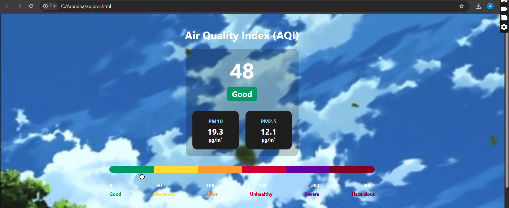
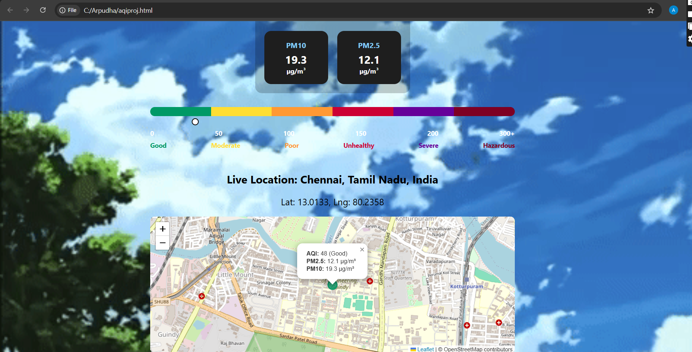
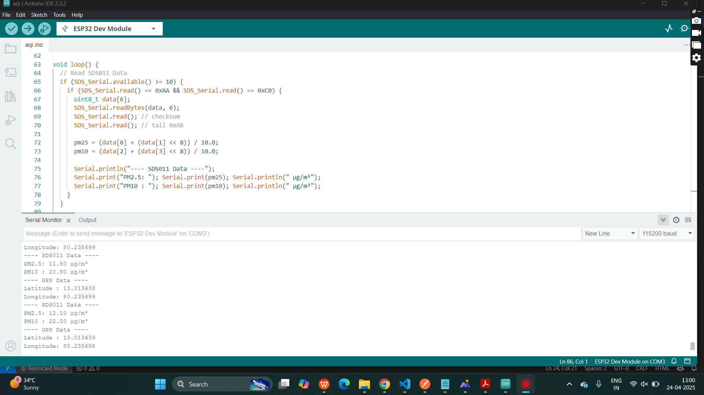

# AQI prediction using IoT and Data Science
## Use Case
Prediction of AQI was done by measuring particulate matter levels in SDS011 sensor. The location of PM index and aqi levels was detected by GPS module (neo6j). The analysis of the aqi was done through data science by analysing the health risk factors. The result were deployed in cloud.

## Prerequisite
Python - Jupyter Notebook (Data Science)\
Arduino IDE - Sensors SDS011, Neo4j, ESP32 (WiFi)\
Deployment - AWS Sagemaker

## Front End
Displays AQI data.\

Displays AQI data along with live location.\

Displays the PM data collected from sensors.\

